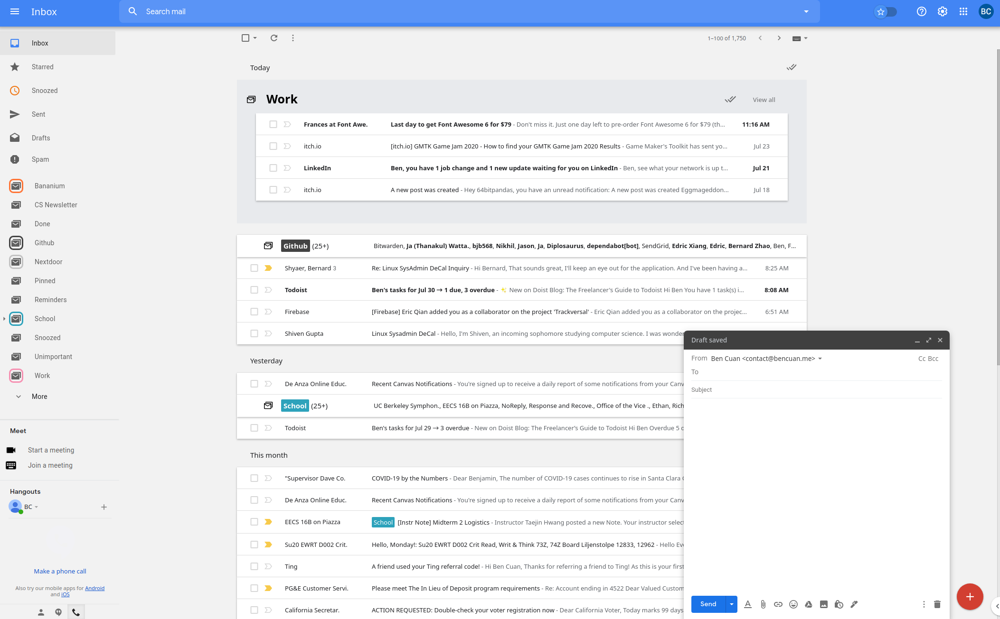

<p align="center">
  
</p>

# Inboxier: a true Google Inbox replacement for Gmail

Inboxier is a fork of [inboxy](https://github.com/teresa-ou/inboxy) with **90% more Inboxiness!!** Responsive bundles are back with the clean Inbox style!

## Features

* Messages with the same label are bundled together in your inbox
* Archive all bundled messages on the current page quickly
* Star a message to pin it outside of its bundle
* Intuitive date headings
* ~~Supports light and dark themes~~ no dark theme yet, sorry :(

## Installation

Inboxier is currently not listed on the Chrome/Firefox stores (but may be soon!)! If you would like to try it out for yourself, follow these instructions:

1. [Download this repository](https://github.com/64bitpandas/inboxy/archive/master.zip) or clone it using `git clone https://github.com/64bitpandas/inboxy`.
2. Unpack the repository to a convenient location (if applicable).
3. Head over to `chrome://extensions` and enable Developer Mode.
4. Click 'Load Unpacked' and select the folder `dist` inside the repository.
5. Enjoy!

## Setup

inboxy uses webpack to bundle js files:

```bash
# Install dependencies
npm install

# Build with webpack to create dist/content.js
npm run build
```

The `dist` directory can then be loaded as an [unpacked extension](https://developer.chrome.com/extensions/getstarted).

## Acknowledgements

**Inboxier could not have been done without the original project, [inboxy](https://github.com/teresa-ou/inboxy). Many thanks for making such a solid bundling script!**

**In addition, the base Inbox stylesheet was imported from [Inbox Reborn](https://github.com/team-inbox/inbox-reborn/blob/master/src/style.css).** I've been using their extension ever since Inbox got discontinued, but unfortunately I was never satisfied with their bundle handling.

### Original inboxy credits:
* [material.io](https://material.io/resources/icons/): Icons in [dist/assets/](https://github.com/teresa-ou/inboxy/tree/master/dist/assets/), [dist/options/assets/](https://github.com/teresa-ou/inboxy/tree/master/dist/options/assets/), and [dist/popup/assets/](https://github.com/teresa-ou/inboxy/tree/master/dist/popup/assets/) are modified versions of icons from material.io. The original material.io icons are licensed under [Apache License 2.0](https://www.apache.org/licenses/LICENSE-2.0.html).
* [Nova](https://www.streamlineicons.com/nova/index.html): The inboxy logo is modified from a Nova icon.

## License

[GPL](/LICENSE), Copyright (C) 2020  [Ben Cuan](https://bencuan.me) with original attribution to [Teresa Ou](https://github.com/teresa-ou)
